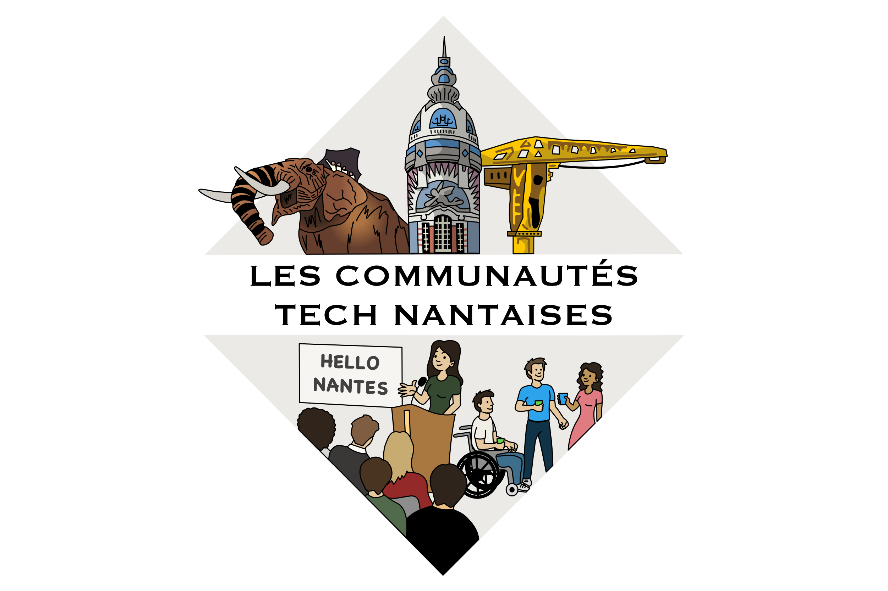

# 🌍 Liste des communautés tech Nantaise

<!-- ALL-CONTRIBUTORS-BADGE:START - Do not remove or modify this section -->

<!-- ALL-CONTRIBUTORS-BADGE:END -->

  
Ce projet permet de lister les communautés bénévoles nantaises et d'offrir des points de contacts aux personnes intéressées pour venir assister à des évènements, ou aux entreprises qui souhaiteraient recevoir l'une de ces communautés.
  Vous pouvez rejoindre la communauté tech nantaise et échanger avec nous sur Slack ici: https://slack.nantes.community
  

  

## 🐘 Les communautés Nantaises

- [AgileNantes](./agilenantes/)
- [Atelier découverte du développement pour les enfants](./dev-enfants/)
- [Blockchain et société](./blockchain-et-societe/)
- [CocoaHeads Nantes](./cocoanantes/)
- [Flupa Nantes](./flupa/)
- [Flutter Grand Ouest](./flutter-grand-ouest/)
- [Human Talks Nantes](./human-talks/)
- [GDG Nantes](./gdg-nantes/)
- [GDG Cloud Nantes](./gdg-cloud-nantes/)
- [GDG Nantes Android](./gdg-nantes-android/)
- [French Produit Nantes-Bretagne](./french-produit/)
- [MTG Nantes](./mtg-nantes/)
- [Nantes DevOps](./nantes-devops/)
- [Nantes JS](./nantesjs/)
- [Nantes JUG](./nantesjug/)
- [Nantes Machine Learning Meetup](./nantes-machine-learning-meetup/)
- [Nantes Numérique Responsable](./nnr/)
- [Nantes Python](./nantes-python/)
- [Nantes.rb](./nantes-rb/)
- [Nocode Nantes](./nocode-nantes/)
- [React Nantes](./react-nantes/)
- [Software Crafters Nantes](./software-crafters/)

## 🐘 Les communautés Nantaises à la recherche d'organisateur·rice
- [CNCF Nantes](./cncf-nantes/)

## 📅 Les événements Nantais

- [DevFest Nantes](./devfest-nantes/)
- [Web2Day](https://web2day.co/)
- [Nantes Digital Week](https://www.nantesdigitalweek.com/) (avec le [Salon de la Data](https://salondata.fr/))
- [Nantes Maker Campus](https://nantesmakercampus.fr/)
- [Digital Change](https://www.digital-change.fr/)
- [Web Island](https://webisland.io/)
- [Cloud Ouest](https://cloudouest.fr/)
- [AgileTour](./agiletour/)

## 📅 Les évènements à venir 

<!-- ALL-EVENTS:START - Do not remove or modify this section -->
<!-- ALL-EVENTS-LIST:START - Do not remove or modify this section -->
|   |   |   |   |   |
|---|---|---|---|---|
| 2023-02-01| FrenchProduit Nantes-Bretagne| Discovery Discipline : Présentation et table ronde| https://www.meetup.com/frenchproduit-nantesbretagne/events/291226459/ | 
| 2023-02-02| Nantes Java User Group| Advanced TypeScript Patterns + Urbaniser un SI pour 10 ans| https://www.meetup.com/nantes-java-user-group/events/291067375/ | 
| 2023-02-02| React Nantes| Meetup React #16| https://www.meetup.com/react-nantes/events/290893462/ | 
| 2023-02-07| Human Talks Nantes| Human Talks - Février 2023| https://www.meetup.com/humantalks-nantes/events/290822289/ | 
| 2023-02-09| FrenchProduit Nantes-Bretagne| Pot FrenchProduit afterwork| https://www.meetup.com/frenchproduit-nantesbretagne/events/291133451/ | 
| 2023-03-14| Human Talks Nantes| Human Talks - Mars 2023| https://www.meetup.com/humantalks-nantes/events/290870042/ | 
<!-- ALL-EVENTS-LIST:STOP - Do not remove or modify this section -->
<!-- ALL-EVENTS:STOP - Do not remove or modify this section -->

## 🖥 Carte de visite

Afin de partager rapidement ces informations, voici un QR code menant au site dédié à ce projet : [https://nantes.community/](https://nantes.community/#/)

## 💫 Contribution

Toute contribution est la bienvenue. Vous organisez un meetup qui n'apparait pas dans la liste, n'hésitez pas à créer une issue 😃.

Un template de fiche de communauté est disponible [👉 ici](./template/template.md).

Merci à tous les contributeurs 🙏

<!-- ALL-CONTRIBUTORS-LIST:START - Do not remove or modify this section -->
<!-- prettier-ignore-start -->
<!-- markdownlint-disable -->
<table>
  <tbody>
    <tr>
      <td align="center" valign="top" width="14.28%"><a href="https://github.com/JuliaLehoux"> <b>JuliaLehoux</b></a></td>
      <td align="center" valign="top" width="14.28%"><a href="https://fr.linkedin.com/in/robincaroff"> <b>Robin Caroff</b></a></td>
      <td align="center" valign="top" width="14.28%"><a href="https://github.com/ebriand"> <b>Eric Briand</b></a></td>
      <td align="center" valign="top" width="14.28%"><a href="https://jtanguy.me"> <b>Julien Tanguy</b></a></td>
      <td align="center" valign="top" width="14.28%"><a href="https://jlandure.dev/"> <b>Julien Landuré</b></a></td>
      <td align="center" valign="top" width="14.28%"><a href="https://www.velvetcocoon.com"> <b>Vachon Stéphanie</b></a></td>
      <td align="center" valign="top" width="14.28%"><a href="https://github.com/patou"> <b>Patrice De Saint Steban</b></a></td>
    </tr>
    <tr>
      <td align="center" valign="top" width="14.28%"><a href="https://github.com/Nabelle"> <b>Nabelle</b></a></td>
      <td align="center" valign="top" width="14.28%"><a href="https://github.com/jeanphibaconnais"> <b>Jean-Phi Baconnais</b></a></td>
      <td align="center" valign="top" width="14.28%"><a href="https://gerome.dev"> <b>Gérôme Grignon</b></a></td>
      <td align="center" valign="top" width="14.28%"><a href="https://pyaillet.gitlab.io/blog/"> <b>Pierre-Yves Aillet</b></a></td>
      <td align="center" valign="top" width="14.28%"><a href="https://github.com/iGranDav"> <b>David Bonnet</b></a></td>
      <td align="center" valign="top" width="14.28%"><a href="https://github.com/marionnousvalentin"> <b>Marion Valentin</b></a></td>
      <td align="center" valign="top" width="14.28%"><a href="https://github.com/kervinkueny"> <b>kervinkueny</b></a></td>
    </tr>
    <tr>
      <td align="center" valign="top" width="14.28%"><a href="http://www.logilab.org"> <b>Arthur Lutz</b></a></td>
      <td align="center" valign="top" width="14.28%"><a href="http://nigui.fr"> <b>Guillaume NICOLAS</b></a></td>
      <td align="center" valign="top" width="14.28%"><a href="http://cecilitse.org/"> <b>Cecile Veneziani</b></a></td>
      <td align="center" valign="top" width="14.28%"><a href="http://thomasrannou.azurewebsites.net/"> <b>Thomas Rannou</b></a></td>
      <td align="center" valign="top" width="14.28%"><a href="https://github.com/LudiDrouet"> <b>LudiDrouet</b></a></td>
      <td align="center" valign="top" width="14.28%"><a href="https://github.com/cbossard"> <b>Cécilia Bossard</b></a></td>
      <td align="center" valign="top" width="14.28%"><a href="https://github.com/agrippaharfleur"> <b>agrippaharfleur</b></a></td>
    </tr>
    <tr>
      <td align="center" valign="top" width="14.28%"><a href="https://github.com/JulienVilleneau"> <b>JulienVilleneau</b></a></td>
      <td align="center" valign="top" width="14.28%"><a href="https://github.com/ArtyMaury"> <b>Artymaury</b></a></td>
    </tr>
  </tbody>
</table>

<!-- markdownlint-restore -->
<!-- prettier-ignore-end -->

<!-- ALL-CONTRIBUTORS-LIST:END -->
