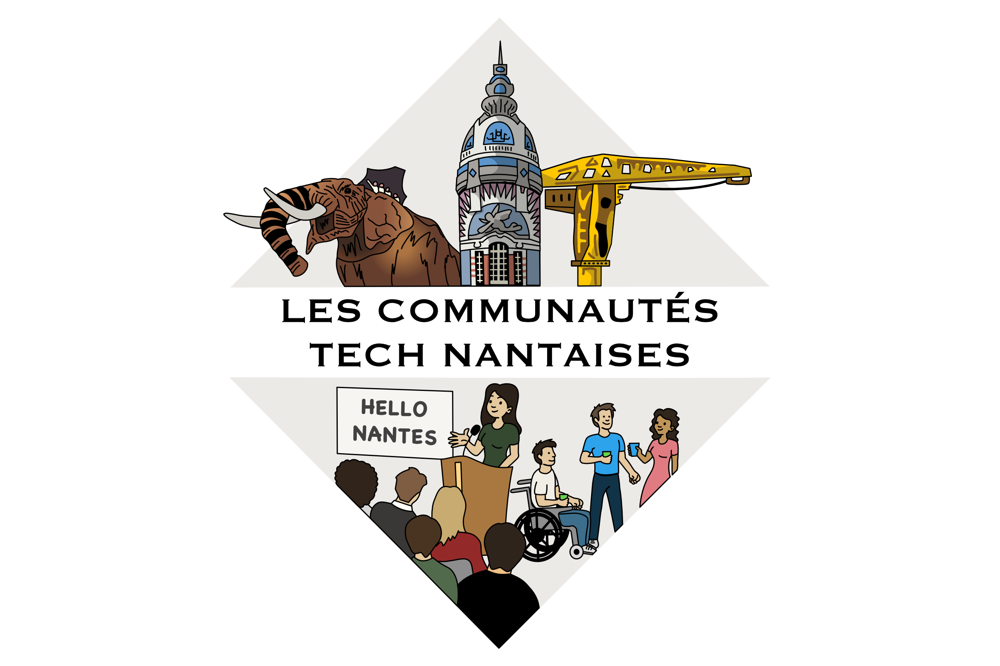

# 🌍 Liste des communautés tech nantaises

<!-- ALL-CONTRIBUTORS-BADGE:START - Do not remove or modify this section -->

<!-- ALL-CONTRIBUTORS-BADGE:END -->

Ce projet permet de lister les communautés bénévoles nantaises et d'offrir des points de contact aux personnes intéressées pour venir assister à des évènements, ou aux entreprises qui souhaiteraient recevoir l'une de ces communautés.
Vous pouvez rejoindre la communauté tech nantaise et échanger avec nous sur Slack. Ouvrez une issue sur le repo pour obtenir une invitation.

## 🐘 Les communautés nantaises

- [AFUP Nantes PHP](./afup-nantes-php/)
- [AgileNantes](./agilenantes/)
- [AWS User Group Nantes](./aws-nantes/)
- [Atelier découverte du développement pour les enfants](./dev-enfants/)
- [CocoaHeads Nantes](./cocoanantes/)
- [Design Systems Nantes](./design-systems-nantes/)
- [Flupa Nantes](./flupa/)
- [Flutter Nantes](./flutter-nantes/)
- [French Produit Nantes-Bretagne](./french-produit/)
- [GDG Nantes](./gdg-nantes/)
- [GDG Cloud Nantes](./gdg-cloud-nantes/)
- [GDG Nantes Android](./gdg-nantes-android/)
- [Generative AI Nantes](./generative-ai-nantes/)
- [Golang Nantes](./golang-nantes/)
- [Lambda Nantes](./lambda-nantes/)
- [MTG Nantes](./mtg-nantes/)
- [Nantes DevOps](./nantes-devops/)
- [Nantes JS](./nantesjs/)
- [Nantes JUG](./nantesjug/)
- [Nantes Machine Learning Meetup](./nantes-machine-learning-meetup/)
- [Nantes Numérique Responsable](./nnr/)
- [Nantes Python](./nantes-python/)
- [Nantes.rb](./nantes-rb/)
- [Nantes@Hack](./nantes@hack/)
- [Naoned Computer Club](./naoned-computer-club/)
- [Nocode Nantes](./nocode-nantes/)
- [React Nantes](./react-nantes/)
- [Software Crafters Nantes](./software-crafters/)
- [Yeeso Nantes](./yeeso-nantes/)

## 🐘 Les communautés nantaises à la recherche d'organisateur·rice

- [Human Talks Nantes](./human-talks/)
- [CNCF Nantes](./cncf-nantes/)

## 📅 Les évènements nantais

- [AgileTour](./agiletour/)
- [DevFest Nantes](./devfest-nantes/)
- [Hackathons Shift](https://shift-hackathon.com/)
- [Mobilis In Mobile](https://mobilis-in-mobile.io/)
- [Nantes Digital Week](https://www.nantesdigitalweek.com/) (avec le [Salon de la Data](https://salondata.fr/))
- [Nantes Maker Campus](https://nantesmakercampus.fr/)
- [Tech Ready](https://techready.live/)
- [Web2Day](https://web2day.co/)

## 📅 Les évènements à venir

<!-- ALL-EVENTS:START - Do not remove or modify this section -->
<!-- ALL-EVENTS-LIST:START - Do not remove or modify this section -->
|   |   |   |   |   |
|---|---|---|---|---|
| 07/04/2026 | France DevOps Nantes| Une image vaut mille mots ? Zoom sur l'approche "Diagram as Code”| https://www.meetup.com/france-devops-nantes/events/313849037/ | 
| 09/04/2026 | CocoaHeads Nantes| CocoaHeads d'Avril| https://www.meetup.com/cocoaheads-nantes/events/313926201/ | 
| 14/04/2026 | FrenchProduit Nantes| Atelier découverte : Décider et agir avec LEGO® Serious Play®| https://www.meetup.com/frenchproduit-nantesbretagne/events/314022660/ | 
| 18/04/2026 | AWS User Group France - Nantes| ⚡ AI For Business Hackathon| https://www.meetup.com/aws-nantes/events/313835131/ | 
| 22/04/2026 | Generative AI Nantes| S4E08 - L'IA agentique pour le service client| https://www.meetup.com/generative-ai-nantes/events/313837377/ | 
| 06/05/2026 | Agile Nantes - Sessions mensuelles| Au secours, je suis un imposteur !| https://www.meetup.com/agile-nantes-sessions-mensuelles/events/310238212/ | 
| 20/05/2026 | Nantes Machine Learning Meetup| Physical AI: End-to-End Learning for Industrial Manipulation| https://www.meetup.com/nantes-machine-learning-meetup/events/313959263/ | 
| 03/06/2026 | Agile Nantes - Sessions mensuelles| Le Lean : la performance centrée sur le sens, la valeur et l’humain| https://www.meetup.com/agile-nantes-sessions-mensuelles/events/310238223/ | 
| 05/06/2026 | GDG Cloud Nantes| TechReady 2026| https://www.meetup.com/gdg-cloud-nantes/events/313907142/ | 
| 08/06/2026 | Nantes Machine Learning Meetup| Ce que l’IA fait au travail. Penser l’automatisation à partir des pratiques| https://www.meetup.com/nantes-machine-learning-meetup/events/313959473/ | 
| 01/07/2026 | Agile Nantes - Sessions mensuelles| Et si on coachait une IA pour des spécifications pertinentes ? | https://www.meetup.com/agile-nantes-sessions-mensuelles/events/310238239/ | 
<!-- ALL-EVENTS-LIST:STOP - Do not remove or modify this section -->
<!-- ALL-EVENTS:STOP - Do not remove or modify this section -->

## 🖥 Carte de visite

Afin de partager rapidement ces informations, voici un QR code menant au site dédié à ce projet : [https://nantes.community/](https://nantes.community/#/)

## 💫 Contribution

Toute contribution est la bienvenue. Vous organisez un meetup qui n'apparait pas dans la liste ? N'hésitez pas à créer une issue 😃.

Un template de fiche de communauté est disponible [👉 ici](./template/template.md).

Merci à tous les contributeur·rices 🙏

<!-- ALL-CONTRIBUTORS-LIST:START - Do not remove or modify this section -->
<!-- prettier-ignore-start -->
<!-- markdownlint-disable -->
<table>
  <tbody>
    <tr>
      <td align="center" valign="top" width="14.28%"><a href="https://github.com/JuliaLehoux"> <b>JuliaLehoux</b></a></td>
      <td align="center" valign="top" width="14.28%"><a href="https://fr.linkedin.com/in/robincaroff"> <b>Robin Caroff</b></a></td>
      <td align="center" valign="top" width="14.28%"><a href="https://github.com/ebriand"> <b>Eric Briand</b></a></td>
      <td align="center" valign="top" width="14.28%"><a href="https://jtanguy.me"> <b>Julien Tanguy</b></a></td>
      <td align="center" valign="top" width="14.28%"><a href="https://jlandure.dev/"> <b>Julien Landuré</b></a></td>
      <td align="center" valign="top" width="14.28%"><a href="https://www.velvetcocoon.com"> <b>Vachon Stéphanie</b></a></td>
      <td align="center" valign="top" width="14.28%"><a href="https://github.com/patou"> <b>Patrice De Saint Steban</b></a></td>
    </tr>
    <tr>
      <td align="center" valign="top" width="14.28%"><a href="https://github.com/Nabelle"> <b>Nabelle</b></a></td>
      <td align="center" valign="top" width="14.28%"><a href="https://github.com/jeanphibaconnais"> <b>Jean-Phi Baconnais</b></a></td>
      <td align="center" valign="top" width="14.28%"><a href="https://gerome.dev"> <b>Gérôme Grignon</b></a></td>
      <td align="center" valign="top" width="14.28%"><a href="https://pyaillet.gitlab.io/blog/"> <b>Pierre-Yves Aillet</b></a></td>
      <td align="center" valign="top" width="14.28%"><a href="https://github.com/iGranDav"> <b>David Bonnet</b></a></td>
      <td align="center" valign="top" width="14.28%"><a href="https://github.com/marionnousvalentin"> <b>Marion Valentin</b></a></td>
      <td align="center" valign="top" width="14.28%"><a href="https://github.com/kervinkueny"> <b>kervinkueny</b></a></td>
    </tr>
    <tr>
      <td align="center" valign="top" width="14.28%"><a href="http://www.logilab.org"> <b>Arthur Lutz</b></a></td>
      <td align="center" valign="top" width="14.28%"><a href="http://nigui.fr"> <b>Guillaume NICOLAS</b></a></td>
      <td align="center" valign="top" width="14.28%"><a href="http://cecilitse.org/"> <b>Cecile Veneziani</b></a></td>
      <td align="center" valign="top" width="14.28%"><a href="http://thomasrannou.azurewebsites.net/"> <b>Thomas Rannou</b></a></td>
      <td align="center" valign="top" width="14.28%"><a href="https://github.com/LudiDrouet"> <b>LudiDrouet</b></a></td>
      <td align="center" valign="top" width="14.28%"><a href="https://github.com/cbossard"> <b>Cécilia Bossard</b></a></td>
      <td align="center" valign="top" width="14.28%"><a href="https://github.com/agrippaharfleur"> <b>agrippaharfleur</b></a></td>
    </tr>
    <tr>
      <td align="center" valign="top" width="14.28%"><a href="https://github.com/JulienVilleneau"> <b>JulienVilleneau</b></a></td>
      <td align="center" valign="top" width="14.28%"><a href="https://github.com/ArtyMaury"> <b>Artymaury</b></a></td>
      <td align="center" valign="top" width="14.28%"><a href="https://github.com/Horsty80"> <b>Horsty</b></a></td>
      <td align="center" valign="top" width="14.28%"><a href="https://screeb.app"> <b>Samuel Berthe</b></a></td>
      <td align="center" valign="top" width="14.28%"><a href="http://www.olivierthierry.com"> <b>Olivier THIERRY</b></a></td>
      <td align="center" valign="top" width="14.28%"><a href="https://github.com/wrouvre"> <b>Willy Rouvre</b></a></td>
      <td align="center" valign="top" width="14.28%"><a href="https://github.com/Angi-g"> <b>Angi</b></a></td>
    </tr>
    <tr>
      <td align="center" valign="top" width="14.28%"><a href="https://github.com/Zenigata"> <b>Johan Bonneau</b></a></td>
      <td align="center" valign="top" width="14.28%"><a href="https://github.com/jeremy-serenne"> <b>Jérémy Serenne</b></a></td>
      <td align="center" valign="top" width="14.28%"><a href="https://github.com/Johbrun"> <b>Johan</b></a></td>
      <td align="center" valign="top" width="14.28%"><a href="https://xvw.lol"> <b>Xavier Van de Woestyne</b></a></td>
    </tr>
  </tbody>
</table>

<!-- markdownlint-restore -->
<!-- prettier-ignore-end -->

<!-- ALL-CONTRIBUTORS-LIST:END -->
