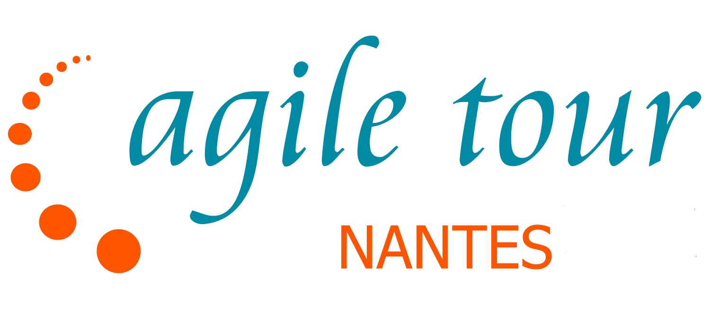

# Agile Tour Nantais

|                |                                                              |
| -------------- | ------------------------------------------------------------ |
|                |                                             |
| 📝 Description             | L'AgileTour Nantais se déroule sur 2 jours, pendant lesquels s'enchainent conférences et ateliers, autour de l'agilité.  On y parle coaching, management, testing, transformation agile...bref, tout ce qui est impacté par l'agilité ! Cet événement est à but non lucratif et l'équipe d'organisation n'est pas rémunérée. |
| 📆 Période             | Deuxième semaine des vacances de Toussaint à l'IUT de Nantes, rue Joffre |
| ✉️ Qui contacter ?             | agilenantes@gmail.com |
| 🌍 Le site web | https://agilenantes.org/evenements/agile-tour-nantes/                  |
| 🗣 Le CFP 2026       | https://sessionize.com/agile-tour-nantais-2026/ |
| 🎥 Replays                     | [Youtube] chaîne AgileNantes |
