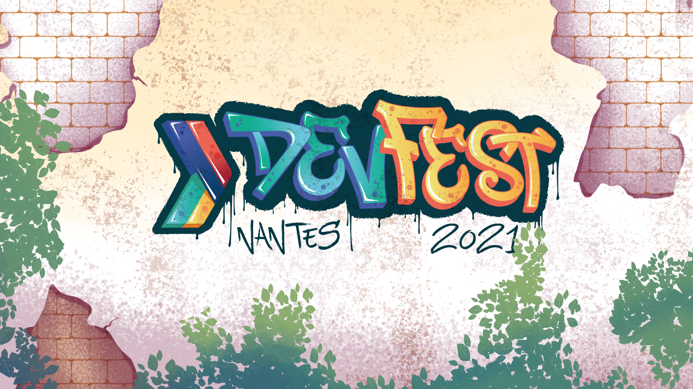

# DevFest Nantes

|                |                                                              |
| -------------- | ------------------------------------------------------------ |
|                |                                             |
| 📝 Description             | « DevFest est LE festival des développeurs organisé par des développeurs ! Toute l'innovation technologique présentée par des experts du monde entier pour une des plus grandes conférences techniques. »   Le DevFest Nantes 2021 est la 9ème édition d'un événement rassemblant des passionnés rassemblés pour réfléchir sur les technologies de demain. Une occasion unique de partager et d'échanger autour des technologies du Web, du Cloud, du BigData, du Mobile et des Objets Connectés.<br.> Organisée par le [GDG Nantes](../gdg-nantes/), association loi 1901 créée en 2011. Cette conférence est communautaire, 100 % à but non lucratif et l'équipe d'organisation n'est pas rémunérée. |
| 📆 Période             | Deuxième quinzaine d'octobre à la Cité des Congrès de Nantes |
| ✉️ Qui contacter ?             | [Annabelle KOSTER](https://twitter.com/AnnabelleKoster) [Julien LANDURÉ](https://twitter.com/jlandure) [Jean-François GARREAU](https://twitter.com/jefbinomed) [Pierrick GUYARD](https://twitter.com/PierrickGuyard) |
| 🌍 Le site web | https://devfest.gdgnantes.com                  |
| 🗣 Le CFP 2021       | https://conference-hall.io/public/event/Hm6qUx8nWpLGQ2uo8ZIq |
| 🎥 Replays                     | [Youtube](https://www.youtube.com/c/Gdg-franceBlogspotFr/playlists) |
| 🌍 Éditions précédentes | https://devfest2021.gdgnantes.com https://devfest2019.gdgnantes.com https://devfest2018.gdgnantes.com https://devfest2017.gdgnantes.com https://devfest2016.gdgnantes.com https://devfest2015.gdgnantes.com https://devfest2014.gdgnantes.com https://devfest2013.gdgnantes.com http://devfest2012.gdgnantes.com  |
