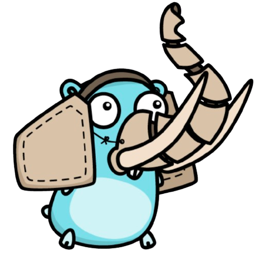

# Golang Nantes

Vous êtes passionné·e par Golang, ou simplement curieux·se de découvrir ce langage de programmation ?
Vous avez envie de présenter un sujet, de poser des questions ou simplement d’échanger ?

Rejoignez notre groupe pour apprendre et partager auprès d'autres Gopherettes et Gophers ! Rendez-vous sur le channel [#nantes_fr du Slack gophers](https://gophers.slack.com/archives/CEAMYNWHK).

On sera ravi de vous accueillir ! 🐹

|                                |                                                               |
| ------------------------------ |---------------------------------------------------------------|
| ✉️ Qui contacter ?             | [Jérémy Serenne](https://www.linkedin.com/in/jeremy-serenne/) |
| 📆 La fréquence des évènements | Mensuel                                                       |
| 🌍 Le site web                 | https://www.meetup.com/golang-nantes/                         |
| ✨ Slack                       | [Rejoindre le slack](https://gophers.slack.com/archives/CEAMYNWHK)              |
