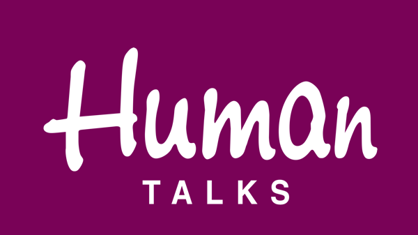

# Human Talks Nantes

Les **Human Talks** ont été créés pour permettre aux développeurs de découvrir de nouveaux langages, technos, méthodologies, projets...
Tous les développeurs sont les bienvenus que ce soit en tant que participant ou Talker. Chaque événement est composé d'une succession de Talks de 10 min chaque fois suivis de quelques questions.

## Quels sujets est-il possible d'aborder ?

Les Human Talks sont centrés sur le partage et la découverte. Alors surprenez-vous !

## Qui peut présenter un Talk ?

Du moment que le sujet vous passionne et que vous le maitrisez assez pour en parler pendant 10 min, vous êtes le bienvenu.
Pas besoin d'être un expert reconnu pour être Talker. Régulièrement des Talks sont donnés par des étudiants (et ils sont très bons !).

|                                |                                                                                                                                                                          |
| ------------------------------ | ------------------------------------------------------------------------------------------------------------------------------------------------------------------------ |
| ✉️ Qui contacter ?             | [Julien Tanguy](https://twitter.com/jutanguy)  [Gérome Grignon](https://twitter.com/GeromeGrignon) [Jean-Philippe Baconnais](https://twitter.com/JPhi_Baconnais) |
| 🌍 Le site web                 | https://humantalks.com/   https://www.meetup.com/fr-FR/HumanTalks-Nantes/                                                                                            |
| 🗣 Le CFP                       | https://humantalks.com/pages/guide-du-talker                                                                                                                             |
| 📆 La fréquence des évènements | Tous les 2èmes mardi de chaque mois                                                                                                                                      |
| 🎥 Replays                     | [Youtube](https://www.youtube.com/c/HumanTalks)                                                                                                                          |
