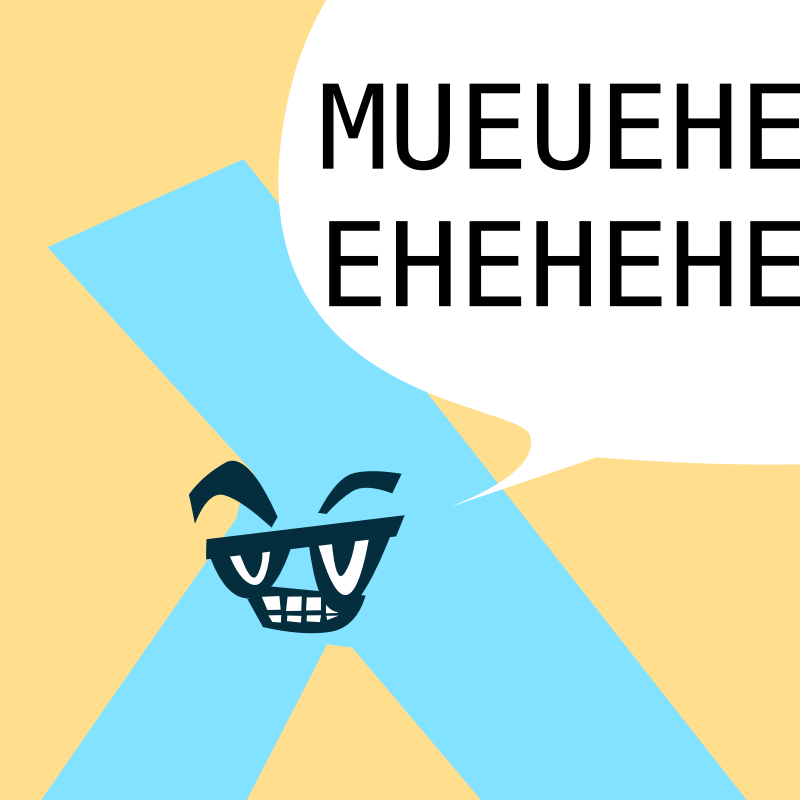

# Lambda Nantes

|                             |                                                                                                                                                    |
|-----------------------------|----------------------------------------------------------------------------------------------------------------------------------------------------|
|                             |                                                                                                                                   |
| 📝 Description              | **Lambda Nantes** est une collection d'évènements (récurrents) qui s'intéressent à l'utilisation des langages "dit Applicatifs" (ou fonctionnels). |
| ✉️ Qui contacter ?           | [Arnaud Bailly](arnaud.oqube@gmail.com) [Xavier Van de Woestyne](xaviervdw@gmail.com)                                                          |
| 🎙 Groupe Mobilizon          | <https://mobilizon.fr/@lambdanantes>                                                                                                               |
| 📆 Fréquence des évènements | mensuel                                                                                                                                            |
