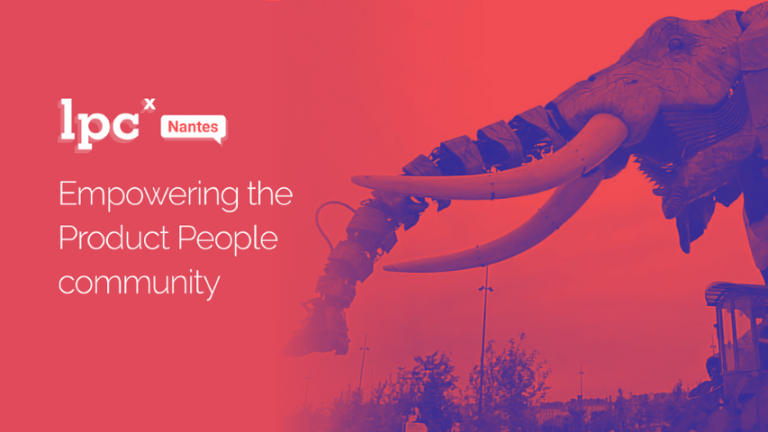

# LPCx Nantes

Anciennement meetup _Product People Nantes_, ce meetup est dédié aux amoureux de la création de produits numériques : Product Managers, Product Owners, VP Product, UX Designers, Design Thinkers. Tous ceux qui au quotidien travaillent dans des organisations produits.

Nos rencontres ont lieu sous 2 formats :

• Des déjeuners informels pour faire connaissance et partager nos expériences.

• Des afterworks le soir avec des courtes présentations, des ateliers ou tables rondes sur un thème bien précis

Vous pouvez nous suivre sur Twitter @LPCXNantes (https://twitter.com/lpcxnantes) et retrouver les 1ères vidéos de notre meetup sur notre nouvelle Chaine Youtube (https://www.youtube.com/channel/UCUQOXTHehEiIAHgxsdAaIgA).

Vous pouvez aussi nous rejoindre notre communauté sur le Slack LPC-Xpedition (https://laproductconf.com/lpc-xpedition/) (channel #villes-nantes).

|                                |     |
| ------------------------------ | --- |
| ✉️ Qui contacter ?              | [Delphine Raymond](https://www.linkedin.com/in/delphineraymond)   [Goulwen Le Fur](https://www.linkedin.com/in/goulwen-le-fur)   [Julien Fritsch](https://www.linkedin.com/in/julienfritsch)   [Julien Tanguy](https://twitter.com/jutanguy)    |
| 🌍 Le site web                 | https://laproductconf.com/lpcx/    |
| 📆 La fréquence des évènements | Mensuel |
| 🎥 Replays                     | https://www.youtube.com/channel/UCO0OJyqS_POidtPlaEoR95Q |
| ✨ Slack                       | https://laproductconf.com/lpc-xpedition/ |
