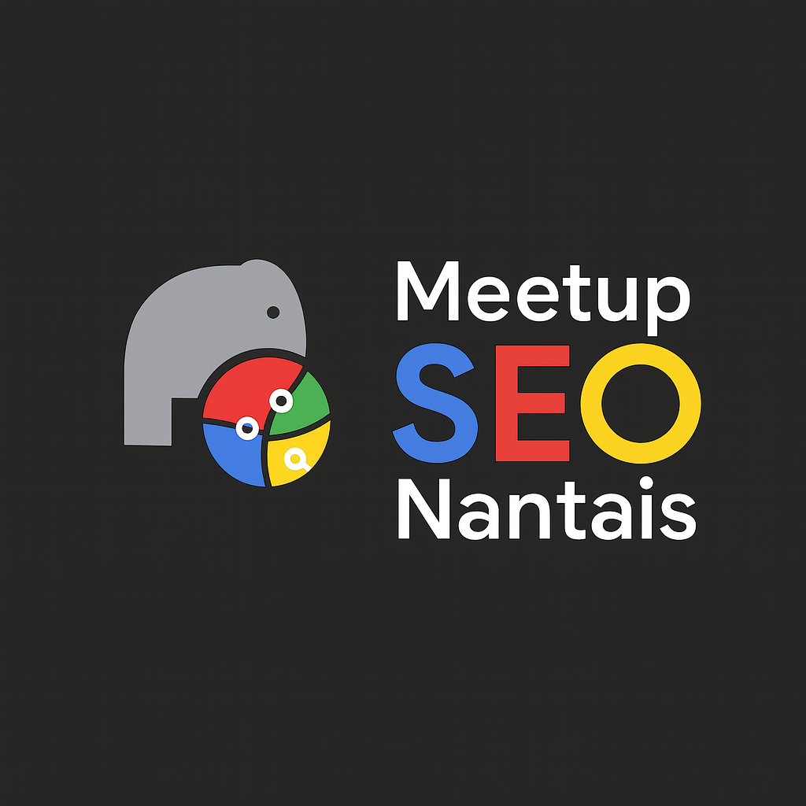

# SEO Nantes

Créé en 2025, la communauté SEO nantaise est récente et regroupe toute personne intéressée de près ou de loin par le SEO et le GEO (que ce soit leur métier ou que l'on soit curieux sur le sujet). On y aborde tous les sujets, pour tous les niveaux : Contenus, Technique, Popularité, Maillage Interne, Marketing et bien plus encore.

Retrouvez-nous tous les deux mois, et n'hésitez pas à proposer vos sujets !

|                                |     |
| ------------------------------ | --- |
| ✉️ Qui contacter ?             | Par message sur la page LinkedIn, ou directement Daniel Roch sur les réseaux sociaux et slack |
| 🌍 Le site web                 | https://www.meetup.com/fr-FR/meetup-seo-nantais/ |
| 🗣 Le CFP                      | Par message sur la page LinkedIn |
| 📆 La fréquence des évènements | Tous les deux mois |
| ✨ LinkedIn | https://www.linkedin.com/company/meetup-seo-nantes/ |