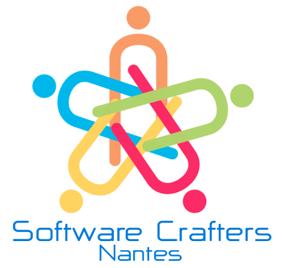

# Software Crafters Nantes

La communauté Software Crafters Nantes réunit les développeu(r|se)s, sans sexisme, élitisme ni langage ou techno obligatoire. 

Vous avez envie de discuter sérieusement de la pratique de votre métier de développeuse.eur ? Vous avez un challenge de code legacy et vous hésitez sur la façon de le résoudre ? Vous vous posez des questions sur votre approche de test dans votre projet ? Vous souhaitez avoir un retour d'autres professionnelles.els sur la qualité de votre code ou de votre design ?

Si vos collègues habituels ne suffisent pas sur tous ces sujets, alors les soirées "Table Ronde" de votre communauté Software Crafters sont faites pour vous ! Amenez vos sujets, questions, bouts de code et problèmes concrets*, ou venez tout simplement avec votre savoir-faire, votre curiosité et votre envie de participer aux échanges.

|                                |     |
| ------------------------------ | --- |
| ✉️ Qui contacter ?             | Twitter @swcraftnantes ou contacter Cécilia Bossard, Sébastien Fauvel, Maxime Sanglan-Charlier ou Jean Paliès sur le slack |
| 🌍 Le site web                 | https://mobilizon.fr/@software_crafters_nantes   |
| 📆 La fréquence des évènements | Tous les 3ème mardi de chaque mois   |
| ✨ Slack                       | https://join.slack.com/t/swcraftnantes/shared_invite/zt-xjt8rwps-TiniNginkuqskLTKeNsqDQ |
| 🐦 Twitter                     | https://twitter.com/@swcraftnantes |

