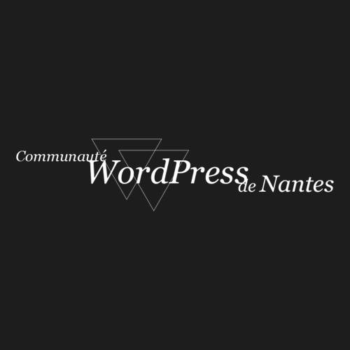

# WordPress Nantes

Depuis 2011, la communauté WordPress de Nantes réunit les passionnés, les débutants et les experts de WordPress autour de moments d'échanges et des conférences sur le CMS. On y aborde tous les sujets, pour tous les niveaux : Sécurité, Développement, WebPerformance, Extensions, SEO, Accessibilité et bien plus.

Retrouvez-nous tous les deux mois, et n'hésitez pas à proposer vos sujets !

|                                |     |
| ------------------------------ | --- |
| ✉️ Qui contacter ?             | Par message sur la page LinkedIn, ou directement Simon Janin ou Daniel Roch sur les réseaux sociaux ou slack |
| 🌍 Les sites web                 | https://www.meetup.com/nantes-wordpress-meetup/ ou https://www.wp-nantes.org/ |
| 🗣 Le CFP                       | https://www.wp-nantes.org/contact/ |
| 📆 La fréquence des évènements | Tous les deux mois |
| ✨ LinkedIn | https://www.linkedin.com/company/meetup-wordpress-de-nantes/ |